# WXC_LLM_Project
## 项目开发目的
该项目旨在基于Llama3-8B大语言模型输入中文医疗数据集并利用LoRA指令微调技术开发一个更加专业的中文医疗大语言模型，实现医患对话功能根据患者情况输出更加专业的医疗建议，系统了解医疗大语言模型的开发过程。
## 项目开发工具和环境
Unsloth：一个开源项目，旨在通过使用更高效的算法来优化和加速大型语言模型的微调过程，支持Llama 3、Gemma 2等多个模型。Unsloth微调过程较传统方法相比快2到5倍，同时减少了约80%的内存使用量。（https://github.com/unslothai/unsloth.git）  
Google Colab：基于云端的交互式笔记本环境，可免费或付费使用其提供的GPU资源用于模型训练，本项目使用Colab Pro提供的L4（约23GB显存）支持训练。
## 项目所用数据集介绍
项目利用Github上的Chinese medical dialogue data——中文医疗问答数据集进行开发。该数据集由男科、内科、妇产科、肿瘤科、儿科、外科六个不同领域的医疗对话数据csv格式文件组成，总计 792099条数，具体格式见图。（https://github.com/Toyhom/Chinese-medical-dialogue-data.git）
## 项目代码解释
### 导入Unsloth和相关支持环境以加速微调过程
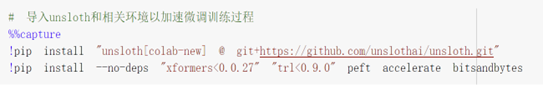
### 下载原始模型（Llama3-8B）
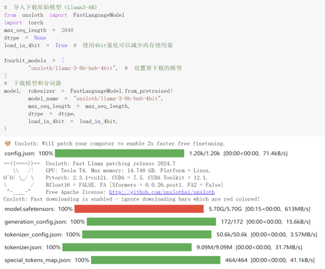
### 下载原始数据集并将其转换为可训练格式（json）
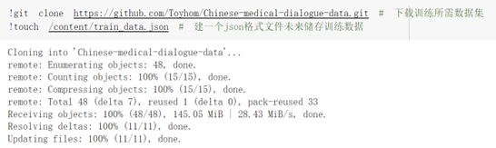
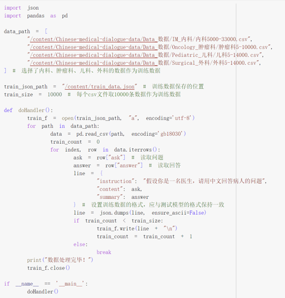
### 设置LoRA适配器
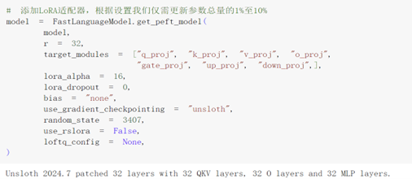
### 测试微调前的模型
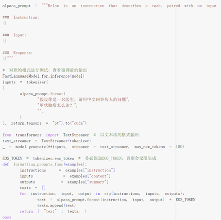
### 设置训练参数并检查内存
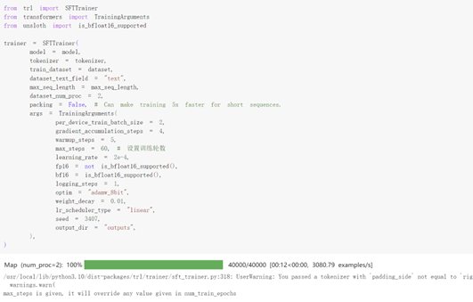
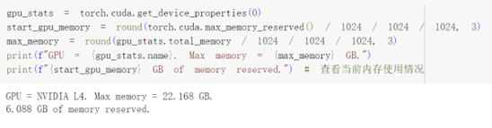
### 训练并输出损失率（可以看出损失率呈下降趋势）
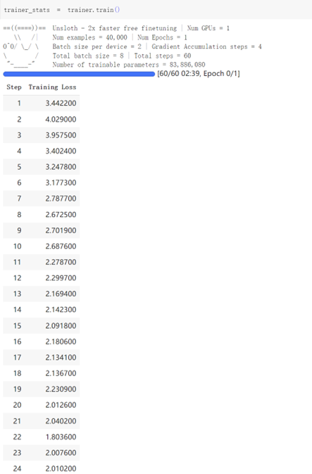
### 查看训练内存使用情况
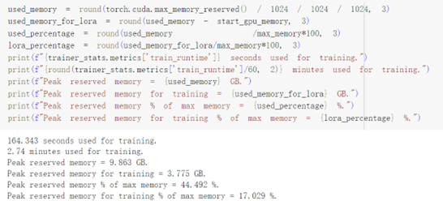
### 测试微调后的模型（同测试微调前的模型）
### 保存微调后模型
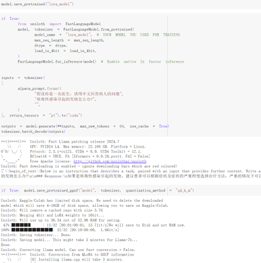
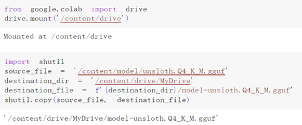
## 项目效果展示

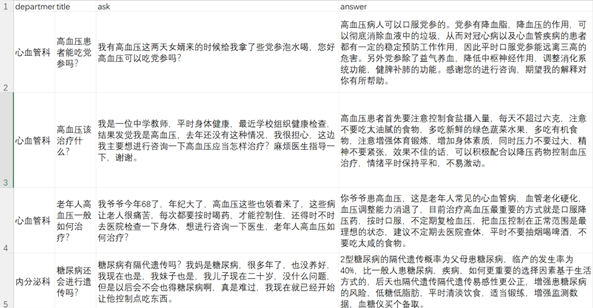  
可以看出，微调后的模型一定程度上已经能够给予一些较为专业的医学建议。但经过多轮测试发现其输出还是不够稳定的，可能与微调训练数据量较少，微调方式等有关，后续有继续改进提高的潜力。
